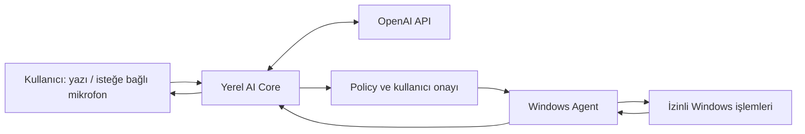
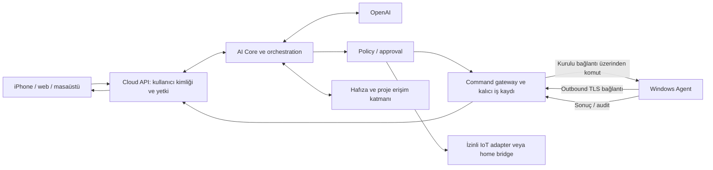

# Ana mimari — öneri

Durum: onay bekleyen taslak. Bileşen sınırları uzun vadeli hedefi gösterir; bugün kurulacak servislerin listesi değildir.

## Yerel başlangıç

Metin MVP'sinde Agent ve tool execution henüz yok. Core; konuşma akışı, OpenAI adapter, timeout, iptal, hata ve kullanım ölçümünü yönetir. Responses API başlangıç önerisidir. Function calling ile üretilen işlem taleplerini bizim uygulamamız doğrular ve çalıştırır; sonuç modele geri verilir. [OpenAI Quickstart](https://developers.openai.com/api/docs/quickstart), [Function calling](https://developers.openai.com/api/docs/guides/function-calling).

Tool aşamasında Core ve Agent ayrı süreçler olur. Yerel iletişim için mevcut Windows kullanıcısına ACL ile sınırlı named pipe önerilir; mesaj şeması, bağlantı kimliği ve çağıran süreç/kullanıcı kontrolü uygulanır. TCP veya LAN listener ilk aşamada gerekli değildir. Aynı kullanıcı hesabında çalışan zararlı süreçlere karşı named pipe tek başına tam izolasyon sağlamaz.

## Uzun vadeli akış

PC portu internete açılmaz. Agent backend'e outbound TLS bağlantısı kurar; backend aynı bağlantıdan komut gönderir. NAT port forwarding ve doğrudan RDP/PowerShell erişimi gerektirmez. Bu trafik şifrelemesidir; backend güven sınırı içindedir, uçtan uca şifreleme vaadi değildir.

İlk cloud sürümü modüler tek backend + Agent olabilir. Kubernetes, ayrı mikroservis filosu veya özel message broker şimdiden zorunlu tutulmaz. Cloud runtime, kuyruk taşıması ve hosting sağlayıcısı uzaktan erişim aşamasında seçilir.

## Sorumluluklar

| Katman | Görev / sınır |
|---|---|
| AI Core | Konuşma, model adapter, tool planı, sonuç yorumu; yetkiyi kendi kendine genişletemez. |
| Policy / approval | Kullanıcı, cihaz, capability, kaynak ve risk bazında deterministik karar; UI onay akışı. |
| Windows Agent | Yerel policy'nin son kontrolü ve typed işlemler; başlangıçta normal kullanıcı yetkisi. |
| Windows UI companion | İleride tray, izin ekranları ve interaktif uygulama/ekran kontrolü. Servis tasarımı ayrı değerlendirilir; Windows servis oturumu interaktif masaüstü yerine varsayılmaz. |
| Command gateway | Kimlik doğrulama, cihaz oturumu, teslimat, iptal, timeout ve sonuç ilişkisi. |
| Identity/device registry | Kullanıcı hesapları, pairing, cihaz anahtarı, capability kaydı ve revocation. |
| Memory | Kullanıcı/proje ayrımı, kaynak, tarih, düzenleme/silme ve erişim politikası. Model konuşma geçmişi kalıcı ürün hafızası sayılmaz. |
| Voice | İlk seçenek push-to-talk; sonra Realtime, VAD, konuşmayı kesebilme ve yerel wake word değerlendirmesi. |
| IoT | Cihaz/protokol bazlı adapter; cihaz capability ve fiziksel riskleri ayrı yetkilendirir. |
| Skills/plugins | Versiyonlu manifest, input/output şemaları, izin kapsamı ve kaynak güveni; plugin install ayrı approval gerektirir. |
| Proje araçları | Mevcut/gelecek projeler typed API/CLI adapter ile açılır; bütün disk veya keyfi shell varsayılan erişim olmaz. |
| Otomasyon/bildirim | Kullanıcıya ait kural ve süreli yetki; revoke/cancel; push bildirimi sonucu UI'dan almayı destekler. |
| Web dashboard | Cihazlar, izinler, job durumları, audit, hafıza ve kullanım. |
| Ticaret/portfolyo | Ürün kataloğu, ödeme, sunucu tarafı abonelik/lisans ve portfolyo; cihaz yönetimi admin alanından ayrılır. |
| İnteraktif AI/3D deneyimler | Web deneyimi; platform API'sine sınırlı ve kimliği doğrulanmış erişim. |

Gerçek zamanlı ses için Realtime API sonraki aşama adayıdır; seçilecek model ve transport o aşamada doğrulanır. [OpenAI Realtime](https://developers.openai.com/api/docs/guides/realtime).

## Teknoloji seçenekleri

| Seçenek | Artı | Maliyet |
|---|---|---|
| A — TypeScript/Node.js Core + C#/.NET Agent | Core/web ekosisteminde ortak dil; Windows tarafında doğal platform entegrasyonu | İki toolchain ve çapraz dil sözleşme yönetimi gerekir. |
| B — C#/.NET Core + C#/.NET Agent | İlk MVP tek toolchain; Visual Studio düzeniyle uyumlu | Web UI yine ayrı teknoloji; Node tabanlı entegrasyonlar adapter isteyebilir. |
| C — Python Core + C#/.NET Agent | Python AI araçlarını kullanmak kolay | Ek runtime/dağıtım yükü; başlangıç ihtiyaçları için belirgin zorunluluk yok. |

Öneri A; daha az başlangıç toolchain'i tercih edilirse B güçlü alternatiftir. Kullanıcı karar vermeden açıklama istedi; teknoloji seçilmedi. OpenAI ile konuşmak, tool çağrısı veya voice kullanmak iki seçenekte de mümkün; seçim AI'ın zekâ seviyesini değiştirmez. A, backend/web tarafında JavaScript/TypeScript araçlarını paylaşmayı kolaylaştırır; B, ilk Core ve Agent için aynı dil, IDE ve build düzenini kullanır. İki dilde de süreçler ayrı kalır ve sürümlü protokolle konuşur. Python yardımcı araç olarak ihtiyaçta kullanılabilir. iOS UI framework'ü, cloud dili/veritabanı ve web framework'ü şimdi kesinleştirilmiyor.

Repository düzeni için kullanıcı multi-repo kararını verdi. Bu belge bileşen sınırlarını tarif eder; her kutu için hemen repository veya servis kurulacağı anlamına gelmez.

## Ürünleştirme sınırları

Her istekte kullanıcı/tenant ve cihaz sahipliği kontrol edilir. Satın alınan lisans bir güvenlik izni değildir; entitlement kontrolü ile cihaz yetkilendirmesi ayrıdır. Ödeme kartı bilgisi platformda tutulmadan bir ödeme sağlayıcısının checkout akışı değerlendirilecek. Çok kullanıcılı dağıtımdan önce veri izolasyonu, backup/restore, anahtar rotasyonu, imzalı Agent güncellemesi ve destek/incident akışı tamamlanmalı.
